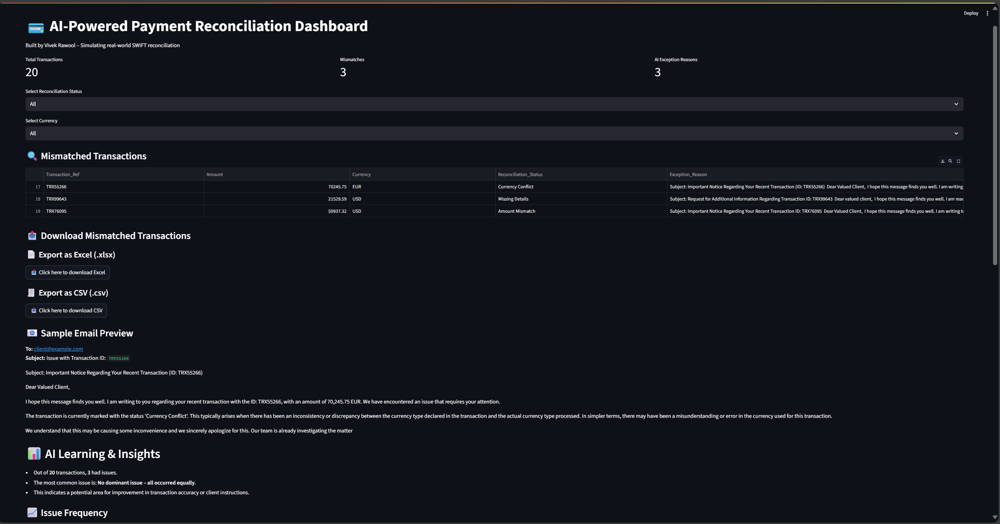

# 💳 AI-Powered Payment Reconciliation Dashboard

An AI-assisted dashboard that reconciles SWIFT MT103 and MT202 transactions, automatically flags mismatches, and generates human-readable exception summaries using rule-based logic and GPT-4.

---

## 🔍 Key Features

- ✅ Reconciles real-looking SWIFT MT103 vs MT202 transactions  
- 🧠 Uses GPT-4 (via ChatGPT) to explain mismatches in plain English  
- 📊 Interactive dashboard with KPIs, filters, downloads, and charts  
- 📌 Exception summary highlights common issues (e.g., Amount Mismatch, Missing BIC)  
- 📩 Sample email previews for flagged transactions  
- 🔍 Filter by transaction reference, status, currency, and reason  
- 📁 Download mismatched or all transactions as Excel or CSV  

---

## 📦 Project Structure

``` AI-Reconciliation-Project/ ├── data/ │ ├── swift_incoming.csv │ ├── swift_outgoing.csv │ └── swift_flagged_data.csv ├── scripts/ │ ├── recon_dashboard.py # Main Streamlit dashboard │ └── add_ai_reasons.py # Adds AI-generated reasons ├── gpt_helper.py # (Used internally for GPT calls) ├── requirements.txt └── README.md ```

---

## 🛠️ How to Run Locally

1. Clone the repo and navigate into it:
 ``` git clone https://github.com/vivekrawool15/ai-reconciliation-dashboard.git cd ai-reconciliation-dashboard ``` 


2. Install dependencies:
``` pip install -r requirements.txt ``` 

3. Run the dashboard:
 ``` streamlit run scripts/recon_dashboard.py ``` 

---

## 🌐 Live Demo

Explore the deployed dashboard (read-only):  
🔗 https://ai-reconciliation-dashboard-baztowsf4s5hbgasr7x7fv.streamlit.app/

Note: This version is read-only for demo purposes. Upload functionality is intentionally disabled.

---

## 📸 Dashboard Preview



---

## 🚀 Deployment

You can deploy this project using:
- Streamlit Cloud — easiest way  
- Render, Railway, or Azure for more flexibility

---

## 🧠 About This Project

This project was conceptualized and built by a non-coder using AI tools like ChatGPT to automate real-world banking workflows. The goal was to reduce manual effort in payment reconciliation and demonstrate how domain experts can build AI-powered tools without coding — by focusing on business logic and AI collaboration.

---

## 📄 License

This project is for educational and demonstration purposes only. No real client data is used.
